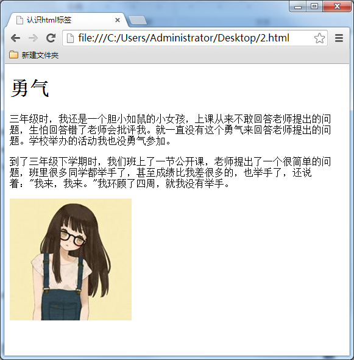
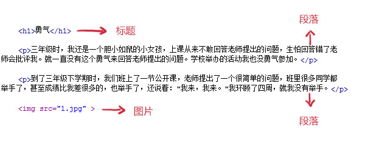
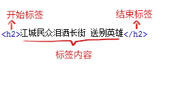
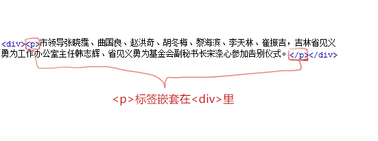
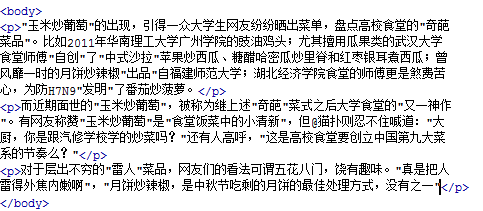
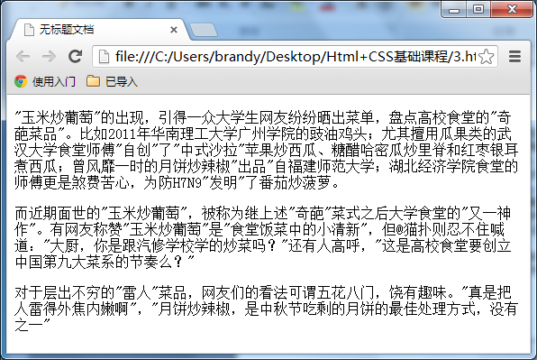
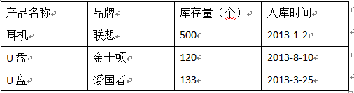
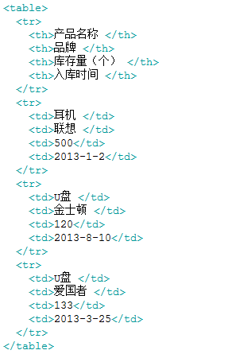
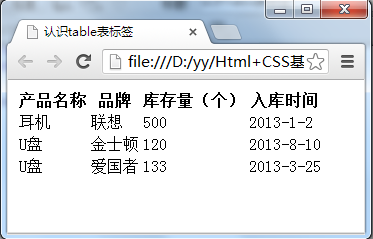
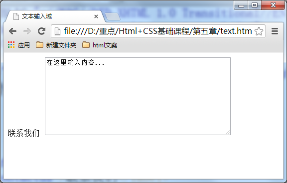

##《写给技术小白的HTML初级教程》
@(HTML初级教程)[|引言|标签语法|p标签]

-------------------
[TOC]

####引言

让我们通过一个网页的学习，来对html标签有一个初步理解。平常大家说的上网就是浏览各种各式各样的网页，这些网页都是由html标签组成的。下面就是一个简单的网页。效果图如下：

我们来分析一下，这个网页由哪些html标签组成：

“勇气”是网页内容文章的标题，`<h1></h1>`就是标题标签，它在网页上的代码写成`<h1>勇气</h1>`。

“三年级时...我也没勇气参加。” 是网页中文章的段落，`

`是段落标签。它在网页上的代码写成 `
三年级时...我也没勇气参加。
`

网页上那张小女生的图片，由img标签来完成的，它在网页上的代码写成``

网页的完整代码如下图： 

总结一下，可以这么说，网页中每一个内容在浏览器中的显示，都要存放到各种标签中。

####标签的语法
- 标签由英文尖括号<和>括起来，如<html>就是一个标签。

- html中的标签一般都是成对出现的，分开始标签和结束标签。结束标签比开始标签多了一个/。

如：
1. `

`

2. `

`

3. ` `

- 标签与标签之间是可以嵌套的，但先后顺序必须保持一致，如：`
`里嵌套`
`，那么`
`必须放在`
`的前面。如下图所示。

-   HTML标签不区分大小写，`<h1>`和`<H1>`是一样的，但建议小写，因为大部分程序员都以小写为准。

####开始学习`
`标签，添加段落

如果想在网页上显示文章，这时就需要`
`标签了，把文章的段落放到`
`标签中。

**语法：**

    
段落文本

  
  注意一段文字一个`
`标签，如在一篇新闻文章中有3段文字，就要把这3个段落分别放到3个`
`标签中。如下图所示。
  
在浏览器中显示的效果：

`
`标签的默认样式，可以在上图中看出来，段前段后都会有空白，如果不喜欢这个空白，可以用css样式来删除或改变它。

####table标签，认识网页上的表格
有时候我们需要在网页上展示一些数据，如某公司想在网页上展示公司的库存清单。如下表：

想在网页上展示上述表格效果可以使用以下代码：

创建表格的四个元素：

table、tbody、tr、th、td
1.`<table>…</table>`：整个表格以`<table>`标记开始、`</table>`标记结束。

2.`<tbody>…</tbody>`：当表格内容非常多时，表格会下载一点显示一点，但如果加上`<tbody>`标签后，这个表格就要等表格内容全部下载完才会显示。如右侧代码编辑器中的代码。

3.`<tr>…</tr>`：表格的一行，所以有几对tr 表格就有几行。

4.`<td>…</td>`：表格的一个单元格，一行中包含几对`<td>...</td>`，说明一行中就有几列。

5.`<th>…</th>`：表格的头部的一个单元格，表格表头。

6.表格中列的个数，取决于一行中数据单元格的个数。

上述代码在浏览器中显示的默认的样式为：

**总结：**

1.table表格在没有添加css样式之前，在浏览器中显示是没有表格线的

2.表头，也就是th标签中的文本默认为粗体并且居中显示

####使用`<a>`标签，链接到另一个页面
使用`<a>`标签可实现超链接，它在网页制作中可以说是无处不在，只要有链接的地方，就会有这个标签。
**语法：**

    <a  href="目标网址"  title="鼠标滑过显示的文本">链接显示的文本</a>
   
  **例如：**
  

    <a  href="http://www.imooc.com"  title="点击进入慕课网">click here!</a>
上面例子作用是单击click here!文字，网页链接到http://www.imooc.com这个网页。

title属性的作用，鼠标滑过链接文字时会显示这个属性的文本内容。这个属性在实际网页开发中作用很大，主要方便搜索引擎了解链接地址的内容（语义化更友好）。

**注意：**还有一个有趣的现象不知道小伙伴们发现了没有，只要为文本加入a标签后，文字的颜色就会自动变为蓝色（被点击过的文本颜色为紫色），颜色很难看吧，不过没有关系后面我们学习了css样子就可以设置过来（a{color:#000}),后面会详细讲解。

####文本域，支持多行文本输入
当用户需要在表单中输入大段文字时，需要用到文本输入域。

**语法：**

    <textarea  rows="行数" cols="列数">文本</textarea>
1.`<textarea>`标签是成对出现的，以`<textarea>`开始，以`</textarea>`结束。

2.cols ：多行输入域的列数。

3.rows ：多行输入域的行数。

4.在`<textarea></textarea>`标签之间可以输入默认值。
**举例：**

    <form  method="post" action="save.php">
        <label>联系我们</label>
        <textarea cols="50" rows="10" >在这里输入内容...</textarea>
</form>
在浏览器中显示结果：

