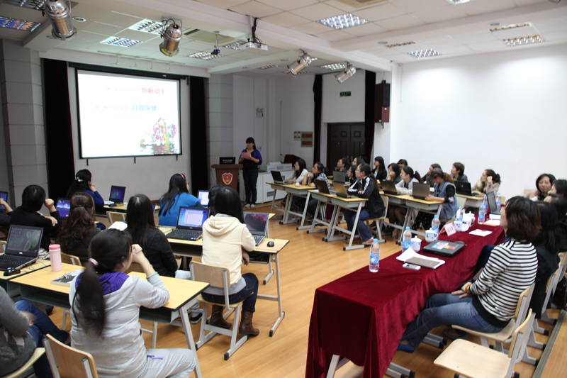
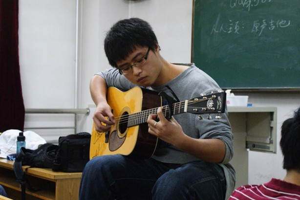
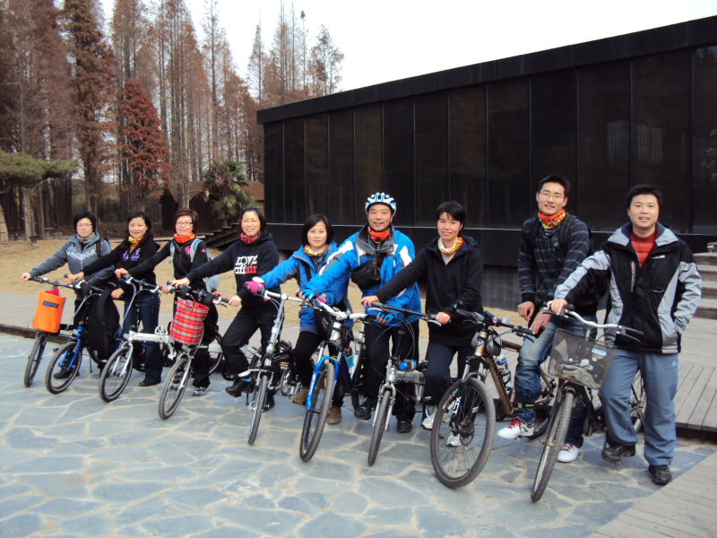

## 实验室组织方案

为了建立一个可持续运作的技术实验室/社团，需要让不同背景、不同技术水平的同学们都能在这个实验室里不断成长，获得各个方面的成长。

[TOC]

设计方案如下：

####分组学习
  - 每组分配一定数量的技术水平不同的同学
  > 水平高的同学带着水平低的同学学习，向他们传授自己的学习经验等；
  > 水平低的同学可以随时向水平高的同学提出自己在学习中遇到的问题，大家可以一起讨论，解决问题。

  - 组内每人轮流每周进行一次技术分享
  

   > 每人可针对自己的发展方向或自己擅长的方面进行分享交流，大家一起讨论。
   

   
  - 组内多元发展，可包括各发展方向的同学
 
####评比

  - 定期进行各小组间的比赛，评出优秀小组、进步小组等，激励大家的学习热情以及上进心。

####活动

- 定期组织小组成员进行聚餐、郊游、游戏等娱乐活动，增进成员之间的感情

- 不定期组织全体实验室成员进行集体活动
- 不定期与其他实验室进行活动，增进集体荣誉感，培养与其他实验室的友好关系